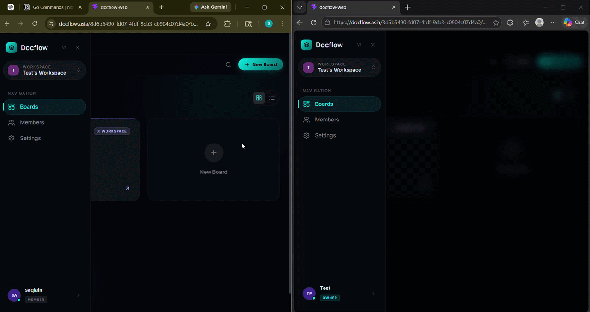
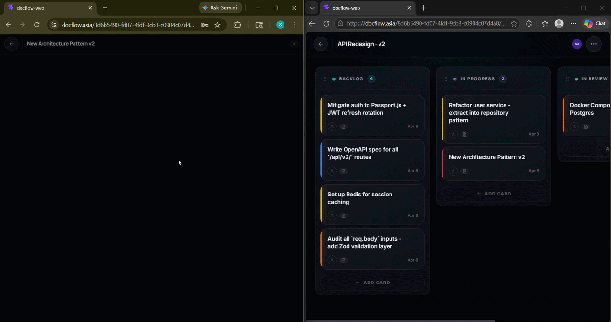

# Docflow — Frontend

The React/TypeScript frontend for [Docflow](https://docflow.asia) — a real-time collaborative workspace combining a Kanban board and rich-text document editor. Built as a full-stack portfolio project to demonstrate production-grade frontend engineering.

**Live:** [docflow.asia](https://docflow.asia) · **Backend:** [docflow-core](https://github.com/saqlainsyb/docflow-core)

### 🧩 Kanban — Real-time drag & drop


### ✍️ Document Editor — Live presence cursors


---

## Features

- **Real-time Kanban board** — drag-and-drop columns and cards with live multi-user sync via WebSocket. Changes from any collaborator appear instantly with no page refresh.
- **Collaborative document editor** — rich-text editing built on Lexical with Yjs CRDT for conflict-free concurrent editing. Displays live presence cursors and typing indicators for every connected user.
- **Workspace & member management** — invite members via email (Resend), manage roles, and switch between workspaces from a persistent sidebar.
- **JWT authentication** — access/refresh token flow with silent token rotation and protected routes.
- **Obsidian Studio design system** — dark glassmorphism UI with `oklch` color tokens, per-column accent colors, dot-grid backgrounds, shimmer hover effects, and restrained Framer Motion micro-interactions.

---

## Tech Stack

| Concern | Choice |
|---|---|
| Framework | React 18 + TypeScript |
| Build | Vite |
| Styling | Tailwind CSS + custom CSS variables (`oklch`) |
| Server state | TanStack Query v5 |
| Client state | Redux Toolkit |
| Real-time | WebSocket (native) + Yjs |
| Editor | Lexical |
| Animations | Framer Motion |
| UI primitives | Radix UI + shadcn/ui |
| Forms | React Hook Form + Zod |
| Notifications | Sonner |
| Deployment | Cloudflare Pages |

---

## Architecture Highlights

**WebSocket collaboration (`useBoardWebSocket`)**
A custom hook manages the board WebSocket connection with exponential backoff reconnection. It handles 10 event types (card created/moved/updated/deleted, column operations, member events) and merges server broadcasts with the local TanStack Query cache — avoiding duplicate state updates when both optimistic cache writes and WebSocket broadcasts would otherwise insert the same item.

**Yjs document sync**
The Lexical editor integrates with a Yjs `Y.Doc` for CRDT-based collaborative editing. A shared awareness protocol broadcasts cursor positions and user presence. An `isInitialSync` ref with a suppression window prevents false "user joined" toasts on initial document load.

**Drag and drop**
Kanban DnD uses `@atlaskit/pragmatic-drag-and-drop` with `rectIntersection` collision detection. Column and card data is attached to drag sources via a `useRef` mirror to avoid stale closure bugs during async state updates.

**Cache invalidation strategy**
Board deletion uses synchronous `setQueryData` + `removeQueries` before the async `invalidateQueries` call to prevent a flash of stale data between the delete confirmation and the cache update.

---

## Local Development

```bash
# Install dependencies
npm install

# Create environment file
cp .env.example .env.local
# Set VITE_API_URL=http://localhost:8080

# Start dev server
npm run dev
```

Requires the [docflow-core](https://github.com/saqlainsyb/docflow-core) backend running locally.

---

## Environment Variables

| Variable | Description |
|---|---|
| `VITE_API_URL` | Backend API base URL |
| `VITE_WS_URL` | WebSocket server URL |

---

## Project Structure

```
src/
├── components/        # Shared UI components (board, editor, modals, sidebar)
├── hooks/             # Custom hooks (WebSocket, auth, queries, mutations)
├── pages/             # Route-level page components
├── store/             # Redux slices
├── lib/               # Utilities, query keys, API client
└── types/             # Shared TypeScript types
```
